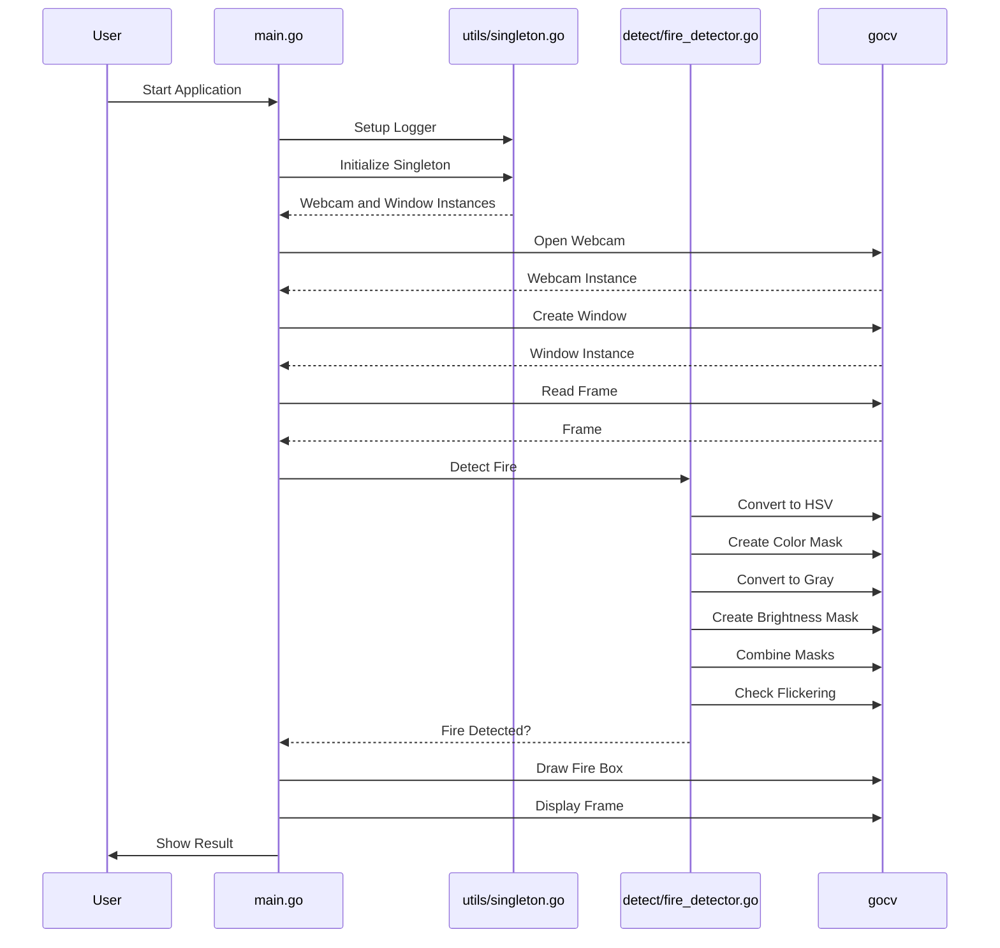

# Fire Detection System

This project implements a fire detection system using the Go programming language and the OpenCV (gocv) library. The system processes video frames to detect fire based on color and brightness masks and checks for flickering.

## Project Structure

- `cmd/` - Contains the main executable
    - `main.go` - The entry point of the application
- `pkg/` - Contains the library code
    - `detect/` - Contains the detection logic
        - `detector.go` - Base detection logic
        - `fire_detector.go` - Fire detection logic
    - `utils/` - Contains utility code
        - `logger.go` - Logging setup
        - `singleton.go` - Singleton pattern implementation

## Design



## Getting Started

### Prerequisites

- Go programming language installed
- OpenCV library installed with Go bindings (gocv)

### Installation

1. Clone the repository:
   ```sh
   git clone hhttps://github.com/arturogonzalezm/fire_detector.git
   cd fire_detector
    ```
